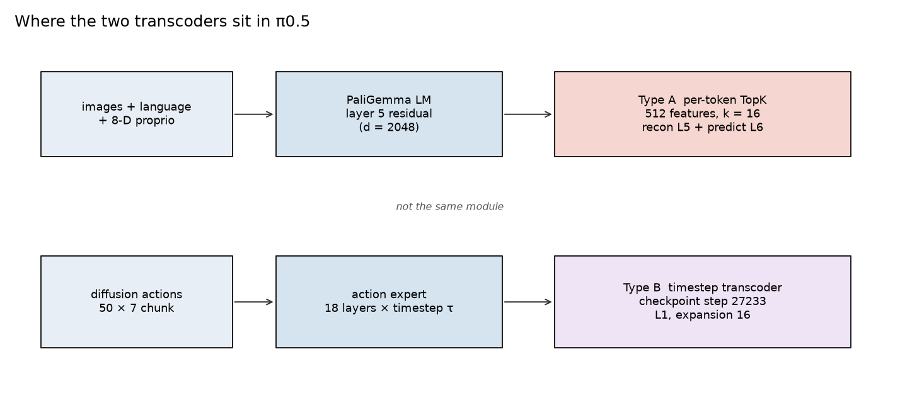
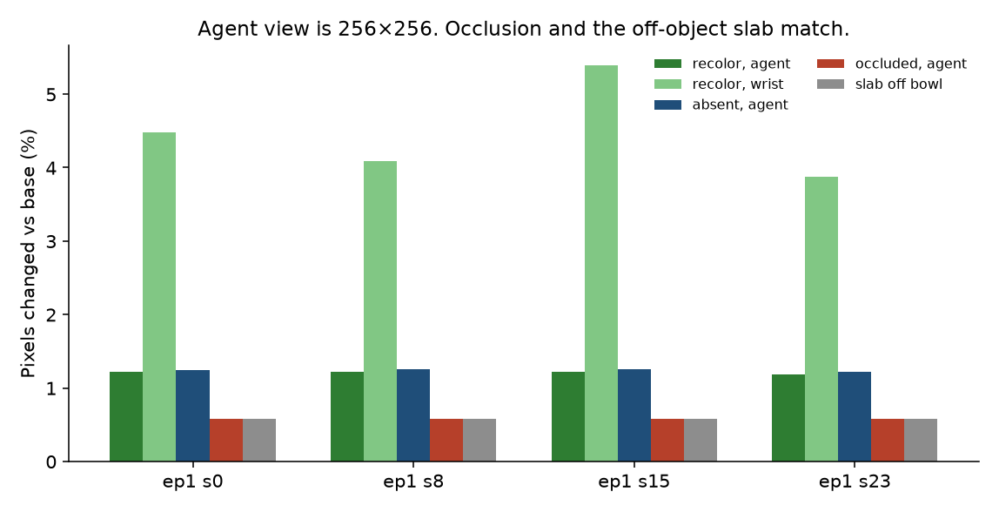
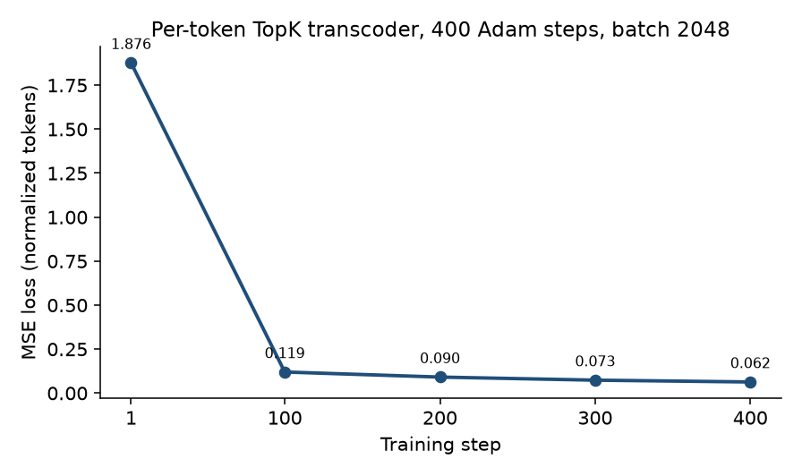
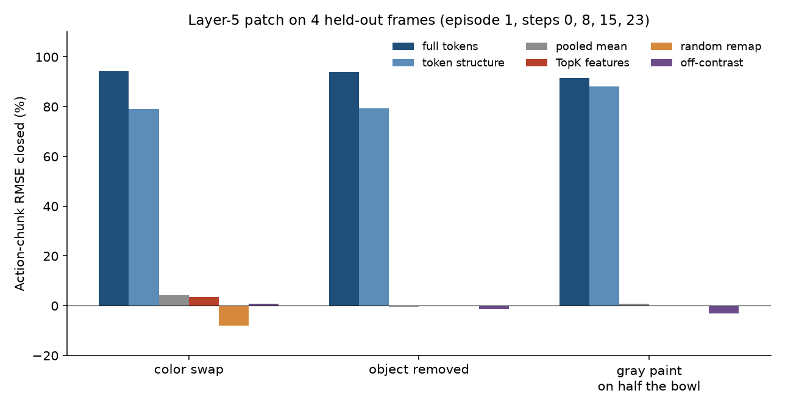
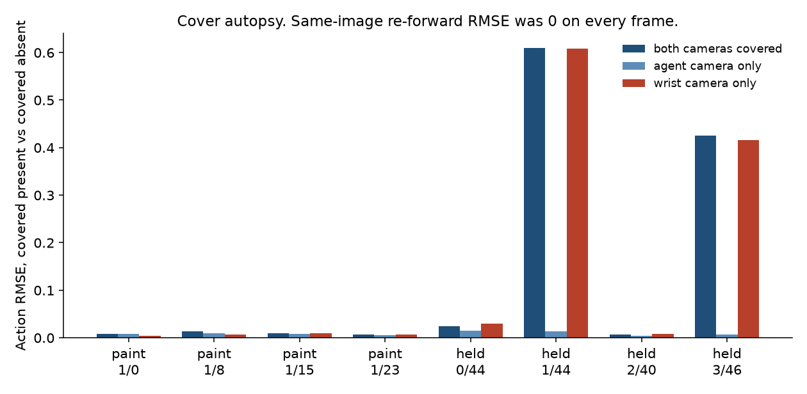
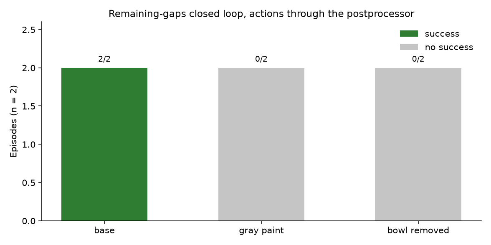
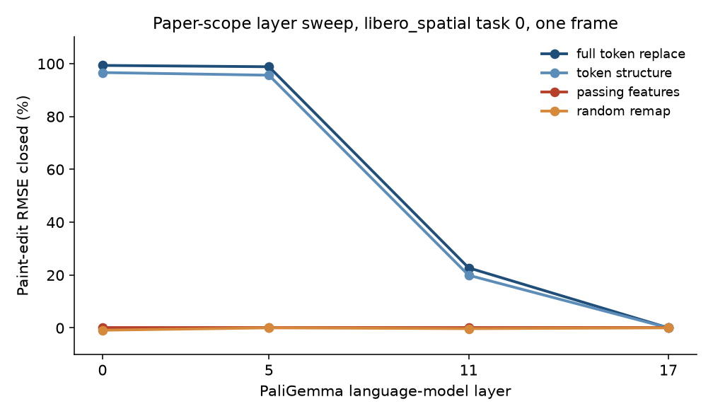

# π0.5 permanence study: methodology and saved results

This report is only the experiments that are in [MarthalaSaiKavya/smaj_final](https://github.com/MarthalaSaiKavya/smaj_final). Every number below is copied from a saved notebook log or from the source that printed that log. Nothing here is filled in from a run that was not saved.

Saved logs:

- `3final_smaj (1).ipynb` and `3final_smaj (2).ipynb` have the same outputs for the setup and permanence cells.
- `3final_smaj (2).ipynb` also has the zip cell, an interrupted permanence-v2 cell, and a paper-scope cell whose log stops mid-rollout.
- `pi05_permanence_research/notebooks/` holds the same experiment code. Those notebooks have no saved outputs.
- `feature_count_sweep`, `token_position_patch`, `token_subspace`, and the tight-cover closed loop are in the source. They have no saved result files in this repository.

Policy: `lerobot/pi05_libero_finetuned`. Demonstrations: LIBERO, task text below. Weights and hdf5 files are not in the git repo.

---

## 1. Plain-language overview

π0.5 is a robot policy. It looks at two cameras (a side camera and a wrist camera), reads a sentence, reads the arm’s position, and outputs a chunk of future arm actions.

The question in this repo is object permanence: if the bowl is still there but you cannot see it, does the next action still treat the bowl as there?

They did not wait for the gripper to hide the bowl. On the saved scans, the gripper never counted as hiding it. Instead they edited the picture, or they moved the bowl out of the scene while leaving the arm exactly where it was, and they asked whether the action chunk changed.

What the saved runs show, in order:

1. Changing the picture does change the action. Putting the edited layer-5 representation back into an otherwise clean forward closes about 91–94% of that action gap on the four probe frames.
2. A small learned code of “which features changed” does not. Those feature patches close about 0% of the same gap, in line with a random feature patch.
3. Painting the bowl gray, or taking it out of the scene, stops the arm from finishing the pick. Showing the real bowl, the arm finishes. That only happens after actions are passed through the policy’s postprocessor. Without that step, even the unedited scene fails.
4. A second kind of transcoder, trained inside the action expert across diffusion time, was searched for a feature that stays on when the bowl is hidden and turns off when the bowl is gone. No such feature was found, so that circuit was not traced.
5. When a plate is placed so the bowl is gone from both cameras, the action does not match “bowl removed.” The plate itself is a new visible object. On the frame where a bowl rim is still visible, painting that rim still does not match a full gray cover.

The short version of the claim the code prints at the end: the next action follows the visible bowl pixels. Two sentences in that printed claim are hard-coded (93% and 1.8%). The measured tables are in section 8. Use those.

---

## 2. Detailed overview

The study is a set of frozen-state interventions on one LIBERO policy, plus one separate action-expert feature screen.

**Model path that was hooked.** The permanence cells hook the PaliGemma language-model block, not the vision tower and not `gemma_expert`:

`model.paligemma_with_expert.paligemma.model.language_model.layers.5`

Layer 6 of the same stack is recorded so the transcoder can predict it. The action-expert experiment is a different stack: 18 layers, each feature tagged with a diffusion time `tau`.

**What is held fixed.** At a demonstration state, language, arm configuration, proprioception, and the diffusion noise seed stay fixed. One visual fact changes. The policy is not allowed to move the arm during the probe. Closed-loop cells are the exception: there the policy’s action chunk is stepped in the simulator.

**What “closed” means.** For a base action chunk \(a_{\text{base}}\) and an edited-image action chunk \(a_{\text{edit}}\), a patch produces \(a_{\text{patched}}\). The reported fraction is how much of the base-to-edit RMSE that patch removes. Full token replacement is the ceiling: it asks whether the action difference lives in that layer’s residual at all. The TopK feature patch asks whether a sparse code of the same difference is enough.

**Main measured split.** On the four probe frames, full replacement and the mean-removed token delta (token structure) carry the action. The pooled token-mean and the contrast-selected TopK features do not. Later cells repeat the feature screen with a stricter “must rise for paint on the bowl” rule and get the same split. A layer sweep on one other frame finds the ceiling only in early language-model layers (0 and 5). By layer 17, replacing the residual closes 0% of the paint gap.

---

## 3. Experimental setup

### 3.1 Runtime that produced the logs

From `3final_smaj (2).ipynb` cells 1–6:

| Item | Saved value |
| --- | --- |
| GPU | NVIDIA A100-SXM4-80GB, driver 580.82.07, 81920 MiB |
| System RAM | about 168 GiB |
| Required GPU setting in the notebook | A100, at least 20 GiB, at least 24 GiB RAM |
| Python env | `/content/lerobot-venv`, Python 3.12, `uv`, torch CUDA 12.8 wheel |
| Install | `lerobot[evaluation,libero,pi]`, `hf-transfer`, `opencv-python`, `numpy` |
| Suite / task id | `libero_spatial`, task 0 |
| Task sentence | pick up the black bowl between the plate and the ramekin and place it on the plate |
| Demo file | `.../libero_spatial/pick_up_the_black_bowl_between_the_plate_and_the_ramekin_and_place_it_on_the_plate_demo.hdf5` |
| Demos in that file | 50. `demo_0` states shape `(98, 92)` |
| Cameras | `OffScreenRenderEnv`, 256×256 |
| Renderer | `MUJOCO_GL=egl` |
| Policy load (permanence cells) | `All keys loaded successfully!` |
| Images | simulator image rotated 180° before the policy, matching the LeRobot LIBERO convention |
| Proprioception | 8 numbers: end-effector xyz (3), axis-angle (3), gripper qpos (2) |
| Hugging Face cache | offline, from an 18.2 GiB Drive archive |
| Action-expert code | git commit `91b2ab0` on branch `feature/akhidre-transcoder-circuit-tracing` |

The action-expert cell printed a vision-tower `state_dict` mismatch (missing `vision_model.embeddings.*` keys, unexpected `vision_tower.embeddings.*` keys) and then continued. Feature collection still finished: 843 observations, 18 layers.

### 3.2 The six pictures

Built at one frozen simulator state. Arm qpos is restored after any teleport.

| Condition | Edit |
| --- | --- |
| `base` | Original render |
| `recolor` | Object color only. Prefer a 3D material edit (red-dominant RGBA becomes green `(0.05, 0.72, 0.12)`, green-dominant becomes red `(0.82, 0.08, 0.08)`). If that edit is not compact, paint the change mask green `(20, 170, 40)` or red `(210, 30, 30)`. The saved probe frames all say `recolor=rgba`. |
| `absent` | Object teleported away. Arm qpos and proprioception stay fixed. |
| `occluded` | Gray `(128, 128, 128)` on half of the recolor mask (pixels left of the mask’s median x). Every other pixel matches `base`. |
| `slab_miss` | That same gray shape, translated off the object. |
| `occluded_absent` | The occlusion paint applied to the absent render. |

A full-cover check paints the whole object mask gray on both the present image and the absent image. If those images agree, one forward has no pixels left that say the object is behind the cover.

### 3.3 Which frames were used

Contrast cell settings, and the log matches them:

- `CTRL_MAX_EPISODES=2`, `CTRL_MAX_STEPS=24`
- Train episode `[0]`, probe episode `[1]`
- Scanned 48 controllable frames. Kept 3 extra training frames and 4 probe frames.
- Probe frames: episode 1, steps 0, 8, 15, 23. All labeled `not_held`.
- Train captures: episode 0, steps 0, 12, 23, conditions recolor / absent / occluded / slab_miss, plus base forwards on episode 0.
- Probe episode is held out of training.
- Noise seed for training forwards: `1000 + episode * 100 + step`
- Noise seed for probe captures: `5000 + episode * 100 + step`
- Determinism: a second base forward on the first probe frame matched tokens with max abs `0.000e+00` and matched the action chunk exactly.

Later cells reuse those probe frames and add gripper frames from the demo scan: `(0, 44)`, `(1, 44)`, `(2, 40)`, `(3, 46)`, all labeled `held_visible`.

### 3.4 When the gripper counts as hiding the bowl

From the replay library in the notebook:

\[
\begin{aligned}
d_{\text{obj}} &= \|\text{object centroid} - \text{camera}\| \\
d_{\text{grip}} &= \|\text{grip site} - \text{camera}\| \\
\text{depth gap} &= d_{\text{obj}} - d_{\text{grip}} \\
\theta &= \arccos\left(\mathrm{clip}\left(\frac{(o-c)\cdot(g-c)}{d_{\text{obj}} d_{\text{grip}}}, -1, 1\right)\right) \\
\theta_{\text{grip}} &= \arctan2(0.03,\ d_{\text{grip}}) \\
\text{angle ratio} &= \theta / \theta_{\text{grip}}
\end{aligned}
\]

Hidden only if depth gap \(> 0.02\) m and \(\theta < \theta_{\text{grip}}\) (angle ratio \(< 1\)). Grip radius default `0.03` m. The code comment expected angle ratio near 0 while grasped, because the grip site and the object centroid nearly coincide. The saved scans do not show that. See section 8.4.

---

## 4. The two transcoders

They are not two widths of the same model. They sit on different modules, use different sparsity, and were trained in different places.

### 4.1 Type A — per-token TopK transcoder (PaliGemma layer 5)

Defined as `TokenTranscoder` in `pi05_permanence_research/source/controlled_contrasts.py`. This is the model behind every permanence circuit table.

- Input: one residual token at language-model layer 5, after per-dimension standardization.
- Dictionary: linear encoder to 512 features. No hidden MLP.
- Sparsity: hard TopK. Keep the 16 largest preactivations, apply ReLU, zero the rest. There is no L1 term.
- Decoder: linear, no bias. Columns are re-unit-normalized after every optimizer step. The encoder rows are scaled by the same norms so the product is unchanged.
- Second head: a bias-free decoder from the same code to standardized layer-6 tokens. Used for the reported layer-6 \(R^2\). Circuit patches use the layer-5 decoder only.
- Init: Kaiming uniform on the encoder (`a = sqrt(5)`), encoder bias 0, decoder initialized to the column-normalized transpose of the encoder.
- Fit on CPU so the policy can stay on GPU. Adam, learning rate `1e-3`, batch 2048, 400 steps, seed 0.
- Train tokens: base forwards from episode 0 (steps before the probe cutoff; the log prints every 8th step) plus the three extra edited frames.

This transcoder does not see the diffusion timestep.

### 4.2 Type B — action-expert transcoders (diffusion time)

Not implemented in this repo. The notebook clones `feature/akhidre-transcoder-circuit-tracing` at `91b2ab0` and calls that branch’s `train_pi05_transcoders.py`, feature collector, feature report, and circuit tracer.

What this repo does record:

- The saved run did **not** train. It loaded an existing checkpoint:  
  `.../transcoders/pi05_libero/allframes_80-10-10_epoch1_b8_exp16_latest_lambda1e-4/step_027233.pt`
- The directory name is the only local record of that training recipe: all frames, an 80/10/10 split, 1 epoch, batch size 8, expansion factor 16, L1 coefficient `1e-4`, step 27233. This repo does not contain that training log, so those fields are the checkpoint name, not a replayed loss curve.
- If no checkpoint had been found, the cell would have trained once with `--num-feed-forwards 100 --batch-size 1 --collection-mode random-timestep --lambda-l1 1e-4 --expansion-factor 16`. That command did not run.
- Feature dump: episodes `0,1,2` of `HuggingFaceVLA/libero` (843 frames, snapshot `86958911c0f959db2bbbdb107eb3e17c5f9c798e`), batch size 1, collection mode `inference`, 10 inference steps, top-k 5, CUDA. The collector reported `layers=18`.
- Each candidate is an id `L{layer}/tau{time}.F{feature}`. The forward hook calls `transcoder(x, timestep, return_preactivation=True)`. Type B is conditioned on the diffusion time. Type A is not.
- Ablation mode in the scorer is `replace` of one feature. The tracer, when it runs, walks the strongest incoming edge from the target, at most 8 nodes, using `edge_score`, else `mean_abs_contribution`, else `edge_influence`.

### 4.3 Side-by-side

| | Type A, layer-5 TopK | Type B, action-expert |
| --- | --- | --- |
| Module | PaliGemma LM layer 5, optional layer-6 prediction | Action expert, 18 layers in the feature dump |
| Conditioning | Token only | Residual plus diffusion timestep `tau` |
| Width in the saved run | 512 features, k = 16, model dim 2048 | Expansion 16 in the checkpoint name. Width is not printed in the log. |
| Sparsity penalty | None. Hard TopK + ReLU | L1 coefficient `1e-4` in the checkpoint name and in the unused train command |
| Trained here? | Yes. 400 steps. Final loss 0.06225 | No. Loaded `step_027233.pt` |
| Intervention used | Add a decoded feature delta at layer 5 | Would replace one latent, then trace a graph. The screen failed, so neither ablation nor the tracer ran |
| Saved result | Reconstructs the probe (layer-5 \(R^2\) 0.974) and does not move the action | No feature kept the object when hidden and dropped it when gone |

“Pooled” in the circuit tables is not a second trained transcoder. It is the mean of the raw token delta, copied onto every token. See section 7.

---

## 5. Formulas, as implemented

**Standardize** a token \(x\) with the training mean \(\mu\) and standard deviation \(\sigma\) (unbiased, variance divided by \(n-1\), floored at `1e-6`):

\[
\tilde{x} = (x - \mu) / \sigma
\]

**TopK code.** Preactivation \(z = W_e \tilde{x} + b\). Let \(S\) be the indices of the \(k\) largest entries of \(z\).

\[
c_i = \begin{cases} \mathrm{ReLU}(z_i) & i \in S \\ 0 & \text{otherwise} \end{cases}
\]

**Decode** back to the residual, and predict the next layer when that head exists:

\[
\hat{x} = (W_d c) \odot \sigma_5 + \mu_5, \qquad \hat{y} = (W_{\text{next}} c) \odot \sigma_6 + \mu_6
\]

**Training loss** (mean squared error, both terms when layer 6 exists):

\[
\mathcal{L} = \mathrm{MSE}(W_d c,\ \tilde{x}) + \mathrm{MSE}(W_{\text{next}} c,\ \tilde{y})
\]

**Probe \(R^2\)** on base tokens. `target.mean(axis=0)` is the mean of each dimension:

\[
R^2 = 1 - \frac{\mathrm{mean}((\hat{x} - x)^2)}{\mathrm{mean}((x - \bar{x}_{\text{dim}})^2)}
\]

If the denominator is below `1e-12`, the code returns 0.

**Action RMSE** over the whole chunk (the postprocessor log shows raw chunks of shape `(50, 7)`):

\[
\mathrm{RMSE}(u, v) = \sqrt{\mathrm{mean}((u - v)^2)}
\]

**Fraction of the gap closed.** \(a_{\text{base}}\) is the clean forward, \(a_{\text{edit}}\) is the forward on the edited image, \(a_{\text{patched}}\) is the clean image with a layer-5 intervention:

\[
g = \frac{\mathrm{RMSE}(a_{\text{base}}, a_{\text{edit}}) - \mathrm{RMSE}(a_{\text{patched}}, a_{\text{edit}})}{\mathrm{RMSE}(a_{\text{base}}, a_{\text{edit}})}
\]

If the baseline RMSE is \(\le 10^{-4}\), \(g\) is left undefined. A negative \(g\) means the patch moved the action farther from the edited-image action.

**Tokens that count as “moved.”** Per-token L2 between base and edited residuals. Keep tokens at or above the 0.85 quantile. If that is fewer than 8 tokens, keep the 8 largest.

**Contrast score** of feature \(i\), mean code change on those tokens:

\[
p_i = \mathrm{mean}_{t \in \text{moved}} \left(c^{\text{edit}}_{t,i} - c^{\text{base}}_{t,i}\right)
\]

**Specificity** against the other contrasts \(o_c\):

\[
s_i = \frac{|p_i|}{|p_i| + \sum_c |o_{c,i}| + 10^{-8}}
\]

The first circuit cell also requires \(|p_i|\) at or above the 90th percentile of \(|p|\), and \(s_i > 0.5\). If fewer than 4 features qualify, it falls back to the largest magnitudes and sets a flag that the set was not specific. The later occlusion cells do not fall back: a feature must **rise** (\(p_i > 0\)), have \(s_i > 0.5\), and clear the 90th percentile. An empty list means none passed.

**Patches at layer 5.**

| Patch | What is written into the layer-5 output |
| --- | --- |
| `full_tokens` | Replace the whole residual with the edited image’s residual |
| `token_structure` | Add \(\Delta - \mathrm{mean}_{\text{tokens}}(\Delta)\), where \(\Delta = x_{\text{edit}} - x_{\text{base}}\) |
| `pooled` | Add the token-mean of \(\Delta\), copied onto every token |
| `transcoder_features` | Add the layer-5 decode of the code delta, with only the chosen features kept |
| `random_remap` | Same code delta moved onto random other features, then rescaled to the same L2 as the real feature patch |
| `off_contrast` | Same idea, using the other contrast’s feature ids (color↔absence, occlusion→color), also L2-matched |

Full-token, pooled, and token-structure patches keep their natural size. Only the sparse patches are norm-matched to each other.

**Occlusion-feature verdict.** A feature count counts as a hit only if its gap exceeds both the random patch and the color-feature patch by at least 0.10.

**Bootstrap.** 2000 resamples of the per-frame gaps, percentile interval from 2.5 to 97.5. Printed in the paper-gaps cell.

**Type B pass rule** (not met by any feature in the log):

- mean firing on `held_visible` and on `held_hidden` both \(> 10^{-4}\)
- mean firing on `gone` \(\le 0.25 \times \min(\text{held visible}, \text{held hidden})\)
- a linear fit of firing on gripper opening must not explain the held-versus-open gap: fail the feature if that fit has \(R^2 \ge 0.5\) and the residual gap is at most 25% of the raw gap

**Gripper-hiding label** is the depth-gap / angle-ratio test in section 3.4. `gone` is the object teleported away with the arm unchanged (`atol = 1e-6` on arm joints).

---

## 6. Hyperparameters

### Type A, the run that was trained

| Knob | Value |
| --- | --- |
| Layer | PaliGemma LM 5, predict LM 6 |
| `d_model` | 2048 (printed as `dim=2048` when the checkpoint was reloaded) |
| Features | 512 |
| TopK `k` | 16 |
| Optimizer | Adam, lr `1e-3`, no weight decay in the code |
| Steps | 400 |
| Batch | 2048 tokens |
| Seed | 0 |
| Device | CPU for training, policy on GPU |
| Top features patched | 8 per contrast in the first circuit cell |
| Specificity floor | 0.5 |
| Magnitude cut | 90th percentile of \(\|p\|\) |
| Moving-token quantile | 0.85, minimum 8 tokens |
| Episodes / steps scanned | 2 episodes, 24 steps |
| Probe frames | 4, held out |
| Extra train frames | 3 |
| Suite | `libero_spatial` task 0 |

### Type A, paper-scope retrain (separate, shorter)

Not a reload of `transcoder.pt`. One new TopK model per layer, same class.

| Knob | Value |
| --- | --- |
| Layers | 0, 5, 11, 17 |
| Features / k | 512 / 16 |
| Steps | 200 |
| Batch | 256 |
| Seed | `0 + layer index` |
| Suites requested | `libero_spatial`, `libero_object`, `libero_goal`, `libero_10`, task 0 |
| Closed loop requested | 10 episodes, horizon 220, replan every 10 |
| Scan | 40 steps, stride 8 |
| What actually finished | `libero_spatial` task 0 only, and the closed loop stops during episode 3’s absent condition. See section 8.9. |

### Type B, the run that was loaded

| Knob | Value in the saved log |
| --- | --- |
| Checkpoint | `step_027233.pt` under `allframes_80-10-10_epoch1_b8_exp16_latest_lambda1e-4` |
| Feature episodes | 0, 1, 2 (843 frames) |
| Collection | inference, batch 1, 10 denoising steps, top-k 5 |
| Report | max 30 features, 5 examples, sort `interesting` |
| Suite for the occlusion screen | `libero_spatial`, seed 0 |
| Pass thresholds | firing floor `1e-4`, gone fraction `0.25`, gripper \(R^2\) `0.5`, residual fraction `0.25` |
| Depth margin / grip radius | `0.02` m / `0.03` m |

### Closed-loop knobs that the logs actually used

| Run | Episodes | Horizon | Re-query | Postprocessor |
| --- | --- | --- | --- | --- |
| Paper gaps, short rollout | the 4 paint frames | 10 steps | once, from that state | not applied (bowl barely moves) |
| Paper claim | 2 | 220 printed (the cell’s `setdefault` is 120, so the runtime already had 220) | every 10 | not applied. Base does not succeed |
| Remaining gaps | 2 | 220 | every 10 | applied. Raw mean abs about 0.75–0.86, post mean abs about 0.32–0.33. Shape `(50, 7)` |
| Paper scope | 10 requested | 220 | every 10 | applied. Log reaches episode 3, absent condition, step 120, then stops |
| Tight cover | 10 in the source | 220 | every 10 | The conclusion cell says those rates were not found |

---

## 7. Circuit tracing

### 7.1 In ordinary words

Take a still frame of the robot looking at the bowl. Run the policy and save the action.

Change one thing in the picture: the bowl’s color, the bowl gone, or gray paint on half the bowl. Run the policy again. The action is different. That difference is the gap.

Now run the clean picture once more, but at one layer reach in and paste in a piece of the edited picture’s internal state. If the action moves most of the way to the edited action, that piece was carrying the decision. If the action stays put, that piece was not.

They paste three kinds of pieces:

- the whole layer (the ceiling)
- the pattern of which tokens changed, with the average change removed
- a handful of learned features that responded to that edit

The whole layer works. The handful of features does not.

The action-expert version is the same idea one stage later, inside the network that turns the image embedding into the action over diffusion time. A feature would have to fire both when the bowl is in the gripper and visible and when it is in the gripper and hidden, and go quiet when the bowl is deleted. None of the reported features had any grasp frames in their top examples, so there was nothing to trace.

### 7.2 What the code actually does

**Type A, one probe frame.**

1. Forward `base` and the edited image at the same noise seed. Record layer-5 tokens and the action chunk. The hook runs once; more than one call is an error.
2. Encode both residuals with the frozen TopK model.
3. Build the six payloads in section 5.
4. Forward the **base image** again. The layer-5 hook either adds the payload or replaces the residual (`full_tokens` only). Layer 6 is not hooked on these patch forwards (`layer6=None`).
5. Compute \(g\) against the edited-image action.
6. Average \(g\) over the 4 probe frames. The printed `n` is 4 for every row.

`edit_l2` is the L2 of the payload (for replace mode, the L2 of payload minus source tokens). It is not an action norm. Sparse patches on a contrast share one L2 because they were norm-matched. Full-token and token-structure L2 are larger. That is intended: the README says they are the reference, not a matched ranking.

**Stricter occlusion screen** (next cell). Same transcoder, no retraining. A feature is kept only if it rises for gray paint on the bowl and stays quiet for the off-bowl slab, the color swap, and removal. The patch is compared with a same-size random remap and with the color features. The bar is +10 percentage points over both.

**Type B.** Rank features from `feature_candidates.json` by how often their top examples are grasps. For the chosen feature, replay demonstration states, label `held_visible` / `held_hidden` / `gone`, and apply the pass rule in section 5. Only a passing feature is ablated and traced. The saved log never gets a candidate: every reported feature has `grasp frames 0/0`.

---

## 8. Results

### 8.1 Pixels, determinism, full cover

Probe frames, fraction of agent-view pixels that differ from base. Wrist recolor is the wrist camera.

| Episode, step | Label | Agent recolor | Wrist recolor | Absent | Occluded | Slab |
| --- | ---: | ---: | ---: | ---: | ---: | ---: |
| 1, 0 | not_held | 0.0122 | 0.0448 | 0.0124 | 0.0058 | 0.0058 |
| 1, 8 | not_held | 0.0122 | 0.0409 | 0.0125 | 0.0058 | 0.0058 |
| 1, 15 | not_held | 0.0122 | 0.0539 | 0.0125 | 0.0058 | 0.0058 |
| 1, 23 | not_held | 0.0119 | 0.0387 | 0.0122 | 0.0058 | 0.0058 |

Occlusion and `slab_miss` match on every frame (0.0058). Absence is about the same size as recolor on the agent view, and larger than the half-mask paint.

Determinism check passed: token max abs `0`.

Full cover on the first probe frame: outside-pixel fraction `0.00040`, action RMSE `0.00790`. Images agree (threshold in code is 0.002). Actions do not agree (threshold `1e-3`). The log calls `0.00790` the residual floor for near-matched images, and says later gap-closed numbers should be read against that floor. The identical-input re-forward had already matched, so this RMSE is not a second-forward jitter.

### 8.2 Type A training

| Step | Loss |
| ---: | ---: |
| 1 | 1.87577 |
| 100 | 0.11891 |
| 200 | 0.09003 |
| 300 | 0.07254 |
| 400 | 0.06225 |

Probe base \(R^2\): layer 5 `0.974` (the reload prints `0.9744404974816373`), layer 6 `0.9710430835374415`.

### 8.3 First circuit: color, absence, occlusion

Score cosines of the full feature-score vectors: color–absence `-0.273`, color–occlusion `0.338`, absence–occlusion `-0.161`.

Mean code difference on tokens that moved. The cell prints the 8 selected features per contrast. Specificity uses the other scores, including the slab.

**Color**

| Feature | Specificity | Color | Absence | Occlusion | Slab |
| ---: | ---: | ---: | ---: | ---: | ---: |
| 161 | 0.741 | 0.623 | -0.201 | 0.018 | -0.002 |
| 123 | 0.955 | 0.435 | 0.018 | -0.002 | -0.000 |
| 439 | 0.863 | 0.267 | 0.040 | -0.002 | 0.000 |
| 325 | 0.877 | 0.250 | 0.032 | 0.003 | -0.002 |
| 222 | 0.643 | 0.172 | -0.090 | 0.006 | 0.021 |
| 204 | 0.692 | 0.057 | -0.008 | 0.017 | -0.002 |
| 39 | 0.583 | -0.053 | -0.036 | -0.002 | 0.000 |
| 116 | 0.559 | 0.045 | -0.032 | -0.003 | 0.006 |

**Absence**

| Feature | Specificity | Color | Absence | Occlusion | Slab |
| ---: | ---: | ---: | ---: | ---: | ---: |
| 197 | 0.666 | 0.315 | -1.475 | 0.426 | -0.212 |
| 203 | 0.572 | 0.051 | -0.780 | -0.531 | 0.019 |
| 129 | 0.822 | 0.071 | 0.765 | -0.095 | 0.064 |
| 57 | 0.615 | 0.204 | -0.754 | 0.268 | -0.131 |
| 184 | 0.818 | 0.013 | 0.642 | -0.130 | 0.100 |
| 270 | 1.000 | 0.000 | 0.523 | 0.000 | 0.515 |
| 49 | 0.811 | 0.103 | 0.495 | -0.012 | 0.061 |
| 408 | 0.513 | 0.225 | -0.485 | 0.234 | -0.019 |

**Occlusion** (this first table is magnitude selection, not the later “must rise” rule)

| Feature | Specificity | Color | Absence | Occlusion | Slab |
| ---: | ---: | ---: | ---: | ---: | ---: |
| 267 | 0.557 | 0.448 | 0.011 | 0.578 | -0.029 |
| 203 | 0.390 | 0.051 | -0.780 | -0.531 | 0.019 |
| 197 | 0.192 | 0.315 | -1.475 | 0.426 | -0.212 |
| 57 | 0.219 | 0.204 | -0.754 | 0.268 | -0.131 |
| 408 | 0.248 | 0.225 | -0.485 | 0.234 | -0.019 |
| 16 | 0.212 | 0.210 | -0.448 | 0.177 | -0.084 |
| 184 | 0.166 | 0.013 | 0.642 | -0.130 | 0.100 |
| 233 | 0.248 | 0.130 | -0.243 | -0.123 | -0.002 |

Several high-absence features are also selected for occlusion, with specificity well below 0.5. That is the fallback path: the code drops the specificity filter when fewer than 4 features qualify.

**Gap closed.** `n = 4` on every row. `base_rmse` is the mean base-to-edit action RMSE.

| Contrast | Patch | Gap closed | Edit L2 | Base RMSE |
| --- | --- | ---: | ---: | ---: |
| color | transcoder features | 3.52% | 450.531 | 0.1812 |
| color | random remap | -8.03% | 450.531 | 0.1812 |
| color | off-contrast | 0.84% | 450.530 | 0.1812 |
| color | full tokens | 94.33% | 710.414 | 0.1812 |
| color | pooled | 4.16% | 184.087 | 0.1812 |
| color | token structure | 78.99% | 686.091 | 0.1812 |
| absence | transcoder features | 0.09% | 476.592 | 0.7647 |
| absence | random remap | 0.06% | 476.592 | 0.7647 |
| absence | off-contrast | -1.37% | 476.596 | 0.7647 |
| absence | full tokens | 93.93% | 1587.124 | 0.7647 |
| absence | pooled | -0.43% | 514.560 | 0.7647 |
| absence | token structure | 79.32% | 1500.810 | 0.7647 |
| occlusion | transcoder features | -0.03% | 259.444 | 0.1995 |
| occlusion | random remap | -0.18% | 259.443 | 0.1995 |
| occlusion | off-contrast | -3.11% | 259.444 | 0.1995 |
| occlusion | full tokens | 91.47% | 506.232 | 0.1995 |
| occlusion | pooled | 0.84% | 127.368 | 0.1995 |
| occlusion | token structure | 88.07% | 489.924 | 0.1995 |

Absence moves the action much more than color or paint (RMSE 0.7647 versus 0.1812 and 0.1995). The feature patch does not track that. Token structure stays close to the full-token ceiling on occlusion (88.07% vs 91.47%) and lower on color and absence (about 79% vs about 94%).

The research README mentions an earlier fidelity run “about 93–98%” full tokens, “about 56–86%” token structure, “about 3–11%” pooled SAE. Those ranges are the README’s summary, not a table in the saved notebooks. The table above is the saved controlled-contrast run.

### 8.4 Occlusion features that have to rise

Reloaded the same checkpoint. `dim=2048`, `features=512`, specificity \(> 0.5\), requested counts `[8, 32, 128]`.

Passed: occlusion 1 feature, color 6 features. Patch count used: `[1]`.

| Feature | Occlusion | Slab | Color | Absence | Specificity |
| ---: | ---: | ---: | ---: | ---: | ---: |
| 366 | 0.039 | 0.009 | -0.012 | -0.008 | 0.574 |

| Count | Patch | Gap closed | Edit L2 | Base RMSE | n |
| --- | --- | ---: | ---: | ---: | ---: |
| reference | full tokens | 85.98% | 515.333 | 0.1840 | 4 |
| reference | token structure | 84.16% | 495.922 | 0.1840 | 4 |
| 1 | occlusion features | 0.70% | 27.621 | 0.1840 | 4 |
| 1 | random remap | 1.25% | 27.621 | 0.1840 | 4 |
| 1 | color features | -0.11% | 27.621 | 0.1840 | 4 |

Printed verdict: no occlusion set beat both controls by 10 points. 1 feature closes 0.7% (random 1.3%, color features -0.1%).

The full-token number here is 85.98%, not the 91.47% in section 8.3. Same four frames, different cell, base RMSE 0.1840 versus 0.1995. Both numbers are printed. They are not averaged in this report.

### 8.5 Paper gaps

Same checkpoint. Reconstruction \(R^2\) printed as `0.9744404974816373`.

Demo scan: 50 demos in the file, 20 scanned at stride 2 (episodes 0–19). Census: `not_held` 584, `held_visible` 376, `held_hidden` 0. Gripper contact frames: hidden 0, visible 376. Four visible frames were forwarded.

**Paint frames, strict rule.** Passed `[144]`. The largest absolute occlusion feature was 108 and it was rejected: falls instead of rising, specificity 0.21 ≤ 0.50, also moves for absence, also moves for paint off the bowl.

| Feature | Occlusion | Slab | Color | Absence | Specificity |
| ---: | ---: | ---: | ---: | ---: | ---: |
| 144 | 0.039 | 0.000 | 0.020 | 0.016 | 0.518 |

Rejected leader 108: occlusion `-0.155`, slab `-0.342`, color `0.010`, absence `0.239`, specificity `0.208`.

**Gripper frames, same rule.** Passed `[158, 169, 4]`. Feature 158 was still flagged “also moves for absence” in the reason list, and it is in the passed table.

| Feature | Occlusion | Slab | Color | Absence | Specificity |
| ---: | ---: | ---: | ---: | ---: | ---: |
| 158 | 0.473 | -0.004 | 0.006 | 0.408 | 0.531 |
| 169 | 0.065 | 0.006 | 0.002 | -0.048 | 0.540 |
| 4 | 0.037 | 0.019 | 0.006 | -0.009 | 0.524 |

**Gap 1, paint edit, causal ceiling versus features.** Bootstrap 2000 draws where an interval is printed.

| Patch | Gap closed |
| --- | --- |
| full prefix | 93.8% [84.2%, 99.1%], n=4 |
| token structure | 84.5% [74.9%, 94.1%], n=4 |
| pooled | 1.1% |
| strict features | 0.4% [-0.5%, 2.2%], n=4 |
| random | 0.6% |
| color features | -0.1% |
| rejected leader | 0.0% |

Printed line: layer-5 reconstruction \(R^2\) is 0.974. The causal ceiling on this paint edit is the full prefix at 93.8%. The features that pass close 0.4%.

**Gap 2, removing the bowl.**

| Set | Mean RMSE vs base | n |
| --- | ---: | ---: |
| paint frames | 0.7938 | 4 |
| gripper frames | 0.7935 | 4 |

Held frames and labels: `(0, 44, held_visible)`, `(1, 44, held_visible)`, `(2, 40, held_visible)`, `(3, 46, held_visible)`.

Held paint: full prefix `80.6%`, strict features `-3.0%`.

Full-cover present vs absent. Outside-pixel fraction and action RMSE. The log’s reading on the first six is the residual-floor sentence. On episode 1 step 44 and episode 3 step 46 the images still “agree” by the 0.002 pixel test, and the action RMSE is large (0.56 and 0.47). The cover-autopsy cell later shows those two frames have tens of thousands of leftover wrist pixels, so “images agree” here is the outside-of-mask fraction, not a claim that the wrist image was unchanged.

| Frame | Label | Outside fraction | Action RMSE |
| --- | --- | ---: | ---: |
| ep 1 step 0 | not_held | 0.00040 | 0.01460 |
| ep 1 step 8 | not_held | 0.00035 | 0.01398 |
| ep 1 step 15 | not_held | 0.00049 | 0.00940 |
| ep 1 step 23 | not_held | 0.00032 | 0.00731 |
| ep 0 step 44 | held_visible | 0.00031 | 0.01594 |
| ep 1 step 44 | held_visible | 0.00008 | 0.56361 |
| ep 2 step 40 | held_visible | 0.00026 | 0.00455 |
| ep 3 step 46 | held_visible | 0.00005 | 0.47459 |

**Gap 3.** 4 paint frames, 4 held frames, task 0 only. Seed A full `93.8%`, seed B full `95.1%`. Seed A structure `84.5%`, seed B structure `90.9%`.

Ten-step rollout from each paint frame. Success stays false. Bowl shift is the same for base, occluded image, and occlusion features:

| Start | Bowl shift (m) |
| --- | ---: |
| ep 1 step 0 | 0.00024855995862270853 |
| ep 1 step 8 | 2.9173788265503566e-06 |
| ep 1 step 15 | 2.9098284025023117e-06 |
| ep 1 step 23 | 2.909827551969213e-06 |

**Gap 4, one example frame’s pixel fractions.** Agent recolor `0.0122`, wrist recolor `0.0448`, agent paint `0.0058`. Sheets were written under `outputs/permanence/paper_gaps/` on the Colab disk. Those PNGs are not in this git repo.

### 8.6 Cover autopsy

Geometry scan: 20 episodes, stride 4. Held samples 190. Hidden even with a zero depth margin: 0.

| Statistic | Min | Median | Max |
| --- | ---: | ---: | ---: |
| Depth gap (m) | -0.0206 | 0.0159 | 0.0403 |
| Angle ratio | 1.109 | 1.572 | 2.296 |

Depth gap \(> 0\): 175. Depth gap \(> 0.02\): 65. Angle ratio \(< 1\): 0. So the angle test never called the gripper a cover, which is why `held_hidden` is 0.

Action RMSE after covering present vs covering absent. `same` is the covered present image forwarded twice.

| Group | Ep | Step | Agent leftover px (peak) | Wrist leftover px (peak) | Both | Agent only | Wrist only | Same | Reading |
| --- | ---: | ---: | --- | --- | ---: | ---: | ---: | ---: | --- |
| paint | 1 | 0 | 11 (86) | 26 (99) | 0.0085 | 0.0080 | 0.0039 | 0 | images agree, action gap small |
| paint | 1 | 8 | 18 (87) | 23 (101) | 0.0133 | 0.0098 | 0.0071 | 0 | images agree, action gap small |
| paint | 1 | 15 | 18 (87) | 32 (101) | 0.0100 | 0.0084 | 0.0100 | 0 | images agree, action gap small |
| paint | 1 | 23 | 16 (86) | 21 (99) | 0.0067 | 0.0047 | 0.0064 | 0 | images agree, action gap small |
| held | 0 | 44 | 5 (87) | 20 (98) | 0.0241 | 0.0154 | 0.0301 | 0 | images agree, action gap small |
| held | 1 | 44 | 5 (89) | 16801 (193) | 0.6093 | 0.0135 | 0.6083 | 0 | images agree, action still moves |
| held | 2 | 40 | 1 (45) | 17 (98) | 0.0065 | 0.0042 | 0.0075 | 0 | images agree, action gap small |
| held | 3 | 46 | 3 (176) | 17528 (205) | 0.4249 | 0.0063 | 0.4152 | 0 | images agree, action still moves |

On the two frames where the action still moves, the wrist image is what moves it. The agent-only cover stays near 0.01 RMSE. The wrist-only cover matches the both-camera RMSE (0.6083 vs 0.6093, and 0.4152 vs 0.4249).

First 10 actions of the chunk versus the rest, and arm motion against a zero action:

| Frame | First-10 action RMSE | Later RMSE | Arm move base | Arm move occluded | Arm move zeros |
| --- | ---: | ---: | ---: | ---: | ---: |
| ep 1 step 0 paint | 0.7558 | 0.3886 | 1.47424 | 1.44479 | 1.61828 |
| ep 1 step 44 held | 0.0184 | 0.0237 | 1.14769 | 1.14441 | 0.63300 |
| ep 3 step 46 held | 0.0193 | 0.0268 | 1.00205 | 1.00428 | 1.65334 |

On the paint frame, base and occluded arm motion are both near the zero-action motion. On the two held frames, base and occluded move the arm by about the same amount, and the first-10 action RMSE between them is about 0.02.

### 8.7 Paper claim

**Geometry across the 10 spatial tasks.** 3 episodes, stride 16. The log prints the same line for every task: held 8, hidden 0, `angle_ratio_min` 1.484. Tasks:

1. pick up the black bowl between the plate and the ramekin and place it on the plate
2. pick up the black bowl next to the ramekin and place it on the plate
3. pick up the black bowl from table center and place it on the plate
4. pick up the black bowl on the cookie box and place it on the plate
5. pick up the black bowl in the top drawer of the wooden cabinet and place it on the plate
6. pick up the black bowl on the ramekin and place it on the plate
7. pick up the black bowl next to the cookie box and place it on the plate
8. pick up the black bowl on the stove and place it on the plate
9. pick up the black bowl next to the plate and place it on the plate
10. pick up the black bowl on the wooden cabinet and place it on the plate

**Wrist mask without the 20% size cap.** `old_w` is the capped mask’s pixel count, `new_w` the uncapped count, `left` leftover bowl pixels, `peak` the peak absolute change, `old_rmse` / `new_rmse` the action RMSE, `painted` the RMSE after painting whatever pixels still differed.

| Group | Ep | Step | Old px | New px | Left | Peak | Old RMSE | New RMSE | Painted | Reading |
| --- | ---: | ---: | ---: | ---: | ---: | ---: | ---: | ---: | ---: | --- |
| paint | 1 | 0 | 2936 | 2936 | 26 | 99 | 0.0098 | 0.0098 | 0.0000 | visible residue remains |
| paint | 1 | 8 | 2682 | 2682 | 23 | 101 | 0.0231 | 0.0231 | 0.0000 | visible residue remains |
| paint | 1 | 15 | 3531 | 3531 | 32 | 101 | 0.0070 | 0.0070 | 0.0000 | visible residue remains |
| paint | 1 | 23 | 2537 | 2537 | 21 | 99 | 0.0143 | 0.0143 | 0.0000 | visible residue remains |
| held | 0 | 44 | 12589 | 12589 | 20 | 98 | 0.2206 | 0.2206 | 0.0000 | visible residue remains |
| held | 1 | 44 | 0 | 16781 | 20 | 99 | 0.5036 | 0.0079 | 0.0000 | visible residue remains |
| held | 2 | 40 | 11357 | 11357 | 17 | 98 | 0.0066 | 0.0066 | 0.0000 | visible residue remains |
| held | 3 | 46 | 0 | 17495 | 33 | 101 | 0.6803 | 0.0061 | 0.0000 | visible residue remains |

On held frames ep 1 step 44 and ep 3 step 46 the old (capped) wrist mask had 0 pixels and a large action RMSE (0.5036 and 0.6803). Dropping the cap paints 16781 and 17495 pixels and the RMSE falls to 0.0079 and 0.0061. Painting the leftover pixels after that brings the two covered forwards to RMSE 0. The identical re-forward is 0, and the painted images differ by 0 agent pixels and 0 wrist pixels. The reading is still “visible residue remains” because leftover bowl pixels are nonzero (20 and 33 on those two frames, 17–32 on the others).

**Ramekin placed on the agent-camera ray** (fraction 0.50 along the ray). Wrist cover stays 0.

| Frame | Depth gap | Angle ratio | Agent cover | Wrist cover | Scene | RMSE base→occluder | RMSE base→absent | Absence gap closed |
| --- | ---: | ---: | ---: | ---: | ---: | ---: | ---: | ---: |
| ep 1 step 0 | 0.5160 | 0.116 | 1.000 | 0.000 | 0.040 | 0.4975 | 1.0164 | 11.5% |
| ep 1 step 44 | 0.5168 | 0.116 | 1.000 | 0.000 | 0.039 | 0.2364 | 0.7478 | -14.6% |

The occluder name in the log is the glazed porcelain ramekin geoms. Covering only the agent camera does not reproduce removal.

**Feature rule on 8 task-0 frames** (the original 4 plus ep 4 steps 0 and 24, ep 6 steps 0 and 24, all `not_held`).

Passed `[366]`. Overlap with the paper-gaps id list `[498, 366]` is `[366]`. Overlap with the strict-run id list `[206, 366, 65]` is `[366]`.

| Feature | Occlusion | Slab | Color | Absence | Specificity |
| ---: | ---: | ---: | ---: | ---: | ---: |
| 366 | 0.041 | 0.008 | 0.001 | -0.020 | 0.590 |

| Patch | Gap closed | n |
| --- | ---: | ---: |
| full tokens | 93.0% | 8 |
| occlusion features | -1.2% | 8 |
| random remap | 0.4% | 8 |
| frozen paper ids | -10.9% | 8 |
| frozen strict ids | 0.9% | 8 |

**Second task.** Task 1, episode 0 step 0: uncapped wrist pixels 2392, leftover 15, peak 102, new RMSE 0.0857, painted RMSE 0.0000, reading “visible residue remains.”

**Closed loop, 2 episodes, 220 steps, re-query every 10, postprocessor not used.** The sim keeps the real bowl. `covered` paints the uncapped mask gray. `absent` shows the teleported bowl and restores it before the step. Proprioception is the live unedited arm.

| Episode | Condition | Success | Steps | Bowl shift (m) | Note |
| ---: | --- | --- | ---: | ---: | --- |
| 0 | base | false → false | 220 | 0.00015743513692052395 | |
| 0 | covered | false → false | 220 | 0.00015743513692052395 | |
| 0 | absent | false → false | 220 | 0.00015743513692052395 | |
| 1 | base | false → false | 220 | 0.00024855995862270853 | |
| 1 | covered | false → false | 120 | 0.00024855995862270853 | stopped: executing action in terminated episode |
| 1 | absent | false → false | 0 | 0.0 | stopped: executing action in terminated episode |

Bowl shift on the finished runs is about 0.2 mm. Success never flips. This loop does not show a difference between base, cover, and absence, because the base policy is not completing the task.

### 8.8 Remaining gaps (postprocessor on)

**Both cameras, frozen frames.** Agent occluder is the ramekin at fraction 0.50, scale 3.0. Wrist occluder is the plate at fraction 0.30, scale 1.5. “Physical” puts both objects in one scene. “Composite” pastes the agent image from the agent-only render and the wrist image from the wrist-only render, and the log labels it as two renders.

Episode 1 step 0. Wrist-camera-to-bowl 0.3961 m. 19 placements searched.

| View | Agent cover | Wrist cover | Scene | Depth / angle (agent) | Wrist depth / angle | RMSE base→view | RMSE base→absent | Gap closed | Reading |
| --- | ---: | ---: | ---: | --- | --- | ---: | ---: | ---: | --- |
| agent only | 1.000 | 0.000 | 0.040 | 0.5160 / 0.116 | undefined | | | | |
| wrist only | 0.000 | 1.000 | 0.424 | undefined | 0.2811 / 0.131 | | | | |
| physical | 1.000 | 1.000 | 0.424 | 0.5160 / 0.116 | 0.2811 / 0.131 | 0.6444 | 0.8363 | 6.1% | one scene hides the bowl from both cameras |
| composite | 1.000 | 1.000 | 0.424 | same | same | 0.7389 | 0.8363 | 20.5% | two renders combined |

Episode 1 step 44. Wrist-camera-to-bowl 0.1269 m.

| View | Agent cover | Wrist cover | Scene | Wrist depth / angle | RMSE base→view | RMSE base→absent | Gap closed | Reading |
| --- | ---: | ---: | ---: | --- | ---: | ---: | ---: | --- |
| agent only | 1.000 | 0.000 | 0.039 | undefined | | | | |
| wrist only | 0.435 | 1.000 | 1.000 | 0.0917 / 0.205 | | | | |
| physical | 1.000 | 1.000 | 1.000 | 0.0917 / 0.205 | 0.8929 | 0.6524 | -12.1% | bowl stays partly visible in a camera |
| composite | 1.000 | 1.000 | 1.000 | 0.0917 / 0.205 | 0.6176 | 0.6524 | -15.1% | bowl stays partly visible in a camera |

On the held frame the plate covers the agent view as well (agent cover 0.435 for wrist-only, scene fraction 1.000). Hiding both cameras does not match removal: the physical gap closed is negative, meaning the occluded action is farther from the absent action than the base action was, or the RMSE to absent grew. The formula is \((d(a_{\text{absent}}, a_{\text{base}}) - d(a_{\text{absent}}, a_{\text{view}})) / d(a_{\text{absent}}, a_{\text{base}})\). For step 44 physical: base→absent 0.6524, base→view 0.8929, so the view is farther from absence than the base is.

**Harness, 40 steps of base actions, then zeros.** Episode 0. Raw mean abs 0.7588, post mean abs 0.3232, both shape `(50, 7)`. After 40 steps: success false, arm move 1.25940, bowl shift 0.000157 m. Zero actions: arm move 0.03660, same bowl shift. Printed: unnormalized actions move the arm farther than a zero action.

**Closed loop with the postprocessor.** Horizon 220, 2 episodes, re-query every 10.

| Episode | Condition | Success | Steps | Bowl shift (m) | Arm move | Raw mean abs | Post mean abs |
| ---: | --- | --- | ---: | ---: | ---: | ---: | ---: |
| 0 | base | false → true | 84 | 0.136533 | 1.72950 | 0.7665 | 0.3254 |
| 0 | covered | false → false | 220 | 0.000157 | 1.62443 | 0.8008 | 0.3301 |
| 0 | absent | false → false | 220 | 0.000157 | 1.98707 | 0.7596 | 0.3229 |
| 1 | base | false → true | 81 | 0.121285 | 1.47634 | 0.8576 | 0.3316 |
| 1 | covered | false → false | 220 | 0.000249 | 1.60318 | 0.8552 | 0.3302 |
| 1 | absent | false → false | 95 | 0.000249 | 3.04010 | 0.7548 | 0.3286 |

Episode 1 absent stopped with “executing action in terminated episode.”

Base succeeds and moves the bowl about 12–14 cm. Gray paint and removal do not succeed, and the bowl stays at its start (shift under 0.3 mm) except that absent episode 1 dies at step 95 with the bowl still unmoved. Intermediate base checkpoints: episode 0 at step 80 is still false with bowl shift 0.157466 m; episode 1 at step 80 is still false with bowl shift 0.129882 m. Success is one replan later.

### 8.9 Conclusion cell (no new rollout)

The tight-cover summary was not on disk. The cell used the fallback plate placements: episode 1 step 0 at fraction 0.90, scale 0.75; episode 1 step 44 at fraction 0.80, scale 0.75. It did not roll out. Printed: “Closed-loop rates from the tight-cover run were not found.”

| Frame | Wrist distance (m) | Fraction / scale | Leftover bowl px (agent, wrist) | Extra plate px (agent, wrist) | Cover agent / wrist / scene |
| --- | ---: | --- | --- | --- | --- |
| ep 1 step 0 | 0.3961 | 0.90 / 0.75 | 0, 0 | 3226, 5845 | 1.000 / 1.000 / 0.134 |
| ep 1 step 44 | 0.1269 | 0.80 / 0.75 | 0, 1486 | 3401, 19732 | 1.000 / 0.911 / 0.534 |

Action RMSE:

| Pair | Ep 1 step 0 | Ep 1 step 44 |
| --- | ---: | ---: |
| base → tight plate | 0.5647 | 1.1701 |
| tight → full gray cover | 0.6468 | 1.3287 |
| paint-the-rim → full gray cover | 0.6468 | 1.3682 |
| full gray cover → absent | 0.6385 | 0.2832 |
| tight → absent | 0.8909 | 1.2902 |
| base → absent | 1.0446 | 0.6052 |

Readings printed by the code:

- Table frame (step 0): leftover bowl pixels are 0. “The bowl pixels are gone. The remaining action versus removal is the extra object, not a hidden bowl.” Cover-to-absent RMSE is 0.6385, which is above the 0.05 cutoff the code uses for “matches removal.”
- Held frame (step 44): 1486 wrist bowl pixels remain. “A visible bowl rim remains, and painting it still leaves an action gap to the full cover.” Paint-rim to cover is 1.3682.

The claim string also appends: “Layer-5 prefix replace already closed 93% of a paint edit; passing features closed 1.8%.” That sentence is a fixed string in `final_claim()`. It is not computed from the two frames above. The measured paint-edit feature gaps in the logs are 0.4%, 0.70%, -0.03%, and -1.2%, not 1.8%. The 93% is in the neighborhood of the paper-gaps full-prefix result (93.8%) and the 8-frame full-token result (93.0%).

### 8.10 Action-expert screen (type B)

Feature discovery finished: 843 observations, 18 layers. The tracer was not started.

Every one of the 30 reported features had 0 grasp frames out of 0 top grasp frames:

| Rank | Id |
| ---: | --- |
| 1 | L6/tau0.9.F11504 |
| 2 | L6/tau0.8.F11504 |
| 3 | L6/tau1.F11504 |
| 4 | L4/tau0.1.F13969 |
| 5 | L6/tau0.7.F11504 |
| 6 | L12/tau0.2.F10574 |
| 7 | L13/tau0.7.F5880 |
| 8 | L0/tau0.1.F3916 |
| 9 | L10/tau0.7.F3296 |
| 10 | L16/tau0.4.F15325 |
| 11 | L13/tau0.1.F6965 |
| 12 | L12/tau0.3.F4092 |
| 13 | L7/tau0.3.F3770 |
| 14 | L8/tau0.1.F13799 |
| 15 | L13/tau0.7.F8698 |
| 16 | L10/tau0.8.F11712 |
| 17 | L6/tau0.3.F11602 |
| 18 | L3/tau0.6.F5574 |
| 19 | L14/tau0.9.F13299 |
| 20 | L10/tau0.8.F10170 |
| 21 | L15/tau0.4.F12944 |
| 22 | L3/tau0.8.F3895 |
| 23 | L13/tau0.8.F12285 |
| 24 | L14/tau0.1.F4335 |
| 25 | L16/tau0.9.F12010 |
| 26 | L10/tau1.F8414 |
| 27 | L15/tau0.2.F10560 |
| 28 | L14/tau0.6.F3179 |
| 29 | L4/tau1.F148 |
| 30 | L11/tau0.2.F8642 |

Printed verdict: “no action-expert feature keeps the object when it is hidden and drops it when it is gone.”

The same sentence is the failure string in `occlusion_contrast.py` when no report row has a grasp among its top examples. There is no per-feature firing rate, no ablation RMSE, and no circuit path in the saved log.

### 8.11 Paper scope (partial)

One suite finished the forward tests: `libero_spatial` task 0. Controllable frames found at episode 0 steps 0 and 8, both `not_held`. The plate test used episode 0 step 0, wrist-camera-to-bowl 0.4226 m.

| Plate | Fraction | Scale | Agent cover | Wrist cover | Scene | RMSE base→view | RMSE base→absent | Gap closed |
| --- | ---: | ---: | ---: | ---: | ---: | ---: | ---: | ---: |
| large | 0.30 | 1.50 | 1.000 | 1.000 | 0.333 | 0.6211 | 1.0455 | 0.5% |
| tight | 0.90 | 0.75 | 1.000 | 1.000 | 0.112 | 0.7989 | 1.0455 | 7.6% |

Printed for the tight plate: “A tight scene hides the bowl from both cameras.” Closing 7.6% of the absence gap means the action is still far from the removed-bowl action (RMSE 0.7989 versus a base-to-absent RMSE of 1.0455).

**Layer sweep on the paint edit.** New TopK model per layer, 200 steps, batch 256. `passed` is how many features cleared the occlusion rule. Knockout zeros the image-token span at that block’s input.

| Layer | Loss step 1 | Loss step 100 | Loss step 200 | Full | Structure | Features | Random | Passed | Knockout / paint | Knock RMSE | Paint RMSE |
| ---: | ---: | ---: | ---: | ---: | ---: | ---: | ---: | ---: | ---: | ---: | ---: |
| 0 | 0.92387 | 0.06768 | 0.03639 | 99.3% | 96.6% | 0.0% | -0.9% | 4 | 5.41 | 1.0135 | 0.1875 |
| 5 | 1.03541 | 0.04927 | 0.05163 | 98.8% | 95.6% | 0.0% | 0.0% | 1 | 5.64 | 1.0572 | 0.1875 |
| 11 | 1.00719 | 0.09528 | 0.07071 | 22.7% | 19.9% | 0.0% | -0.3% | 1 | 4.81 | 0.9021 | 0.1875 |
| 17 | 1.54681 | 0.10148 | 0.07798 | 0.0% | 0.0% | 0.0% | 0.0% | 2 | 0.07 | 0.0134 | 0.1875 |

Paint RMSE is 0.1875 at every layer because it is the image edit, not the layer. Replacing layer 0 or layer 5 closes essentially the whole paint gap. Replacing layer 17 closes none of it. Zeroing image tokens moves the action by about 1.0 RMSE at layers 0, 5, and 11, which is 4.8–5.6 times the paint edit. At layer 17 that knockout RMSE is 0.0134, smaller than the paint edit. Passing features close 0.0% at all four layers.

**Closed loop, postprocessor on, horizon 220.** The log includes finished episodes 0–2 for base, covered, absent, and physical, plus episode 3 base and covered. It stops at episode 3 absent, step 120. Episodes 4–9 are not in the log. Other suites are not in the log. No Wilson interval was printed.

Finished successes:

| Episode | Base | Covered | Absent | Physical (plate) |
| ---: | --- | --- | --- | --- |
| 0 | true at step 86, bowl shift 0.150810 m, arm 1.83115 | false at 220, bowl 0.000157 m, arm 1.63996 | false at 220, bowl 0.000157 m, arm 3.13063 | false at 220, bowl 0.015079 m, arm 1.47807 |
| 1 | true at step 82, bowl 0.145091 m, arm 1.80118 | false at 220, bowl 0.000469 m, arm 1.48892 | false at 220, bowl 0.000249 m, arm 3.07637 | false at 220, bowl 0.038088 m, arm 1.24904 |
| 2 | true at step 88, bowl 0.140427 m, arm 1.72999 | false at 220, bowl 0.000153 m, arm 3.05913 | false at 220, bowl 0.000153 m, arm 3.11611 | false at 220, bowl 0.044687 m, arm 1.43249 |
| 3 | true at step 85, bowl 0.135449 m, arm 1.80088 | true at step 181, bowl 0.113807 m, arm 2.01844 | log ends at step 120, still false | not started in the log |

Episode 3 covered is the one gray-paint success in the saved logs. By step 80 the bowl had already moved 0.027154 m, still unsuccessful; success is at step 181. The physical plate does not succeed on episodes 0–2. It does move the bowl a few centimeters (0.015 m, 0.038 m, 0.045 m), unlike gray paint and absence, which leave the bowl at the start on those episodes.

First-chunk magnitudes on episode 0: base raw mean abs 0.7424, post 0.3243; covered 0.7958 / 0.3266; absent 0.7637 / 0.3288; physical 0.7669 / 0.3251.

### 8.12 Cells that produced no measurements

| Cell | What the log shows |
| --- | --- |
| First action-expert attempt (`3final_smaj` cell 15) | Downloaded 843 frames, then `SystemExit: Could not materialize HuggingFaceVLA/libero` at the expected path. The next cell linked the snapshot and ran. |
| Conclusion before `tight_cover.py` existed (cell 17) | `SystemExit: scripts/tight_cover.py is missing.` The following cell wrote the module and ran the conclusion forwards. |
| Pack zip (notebook 2 only) | Wrote `/content/pi05_permanence_research.zip`, 52178707 bytes, and copied it to Drive. |
| Permanence v2 | Wrote `permanence_v2.py`, then `KeyboardInterrupt`. No table. |
| Notebook cell “controlled causal fidelity” | Source is in notebook 2. No output was saved. |
| `feature_count_sweep.py` | Specified (counts 8, 32, 128, 512, plus random and off-contrast). No saved run. |
| `token_position_patch.py` | Specified (top 1%, 5%, 15%, 50% of tokens by movement, versus random positions and least-moved). No saved run. |
| `token_subspace.py` | Specified (on the top 5% and 15% of moving tokens: full delta, mean, rank 1, 4, 16). No saved run. |
| `tight_cover.py` rollout | Source asks for 10 episodes of visible bowl, gray paint, removed bowl, and tight plate. The conclusion cell did not find those rates. |

---

## 9. What the saved numbers support

On this policy, this task, and these frames:

- The action difference caused by recoloring, deleting, or half-painting the bowl is in the PaliGemma language-model residual at layer 5. Replacing that residual closes 91–94% of the gap on the four probe frames, 93.8% (interval 84.2–99.1%) on the paper-gaps paint set, 93.0% on eight frames, and 98.8–99.3% at layers 0 and 5 in the one-frame layer sweep.
- Most of that is token-to-token structure, not a single vector added to every token. Pooled means close 4% or less. Token structure closes 79–88% on the four-frame circuit and 95–97% at layers 0 and 5 in the sweep.
- The TopK code reconstructs the residual (\(R^2\) about 0.97) and does not carry the action. Selected features close roughly 0%, including the features that pass a specificity screen. Random features do the same.
- By layer 17, even full replacement closes 0% of the paint gap on the swept frame.
- Natural gripper occlusion did not occur in the scanned demonstrations: 0 hidden frames, angle ratio always at least 1.109 on the 190-frame autopsy.
- With actions unnormalized, a 220-step loop does not succeed even on the real bowl. With the postprocessor, the real bowl succeeds in 2/2 episodes (remaining gaps) and in 4/4 finished paper-scope episodes. Gray paint fails those 2 remaining-gaps episodes and fails 3 of 4 finished paper-scope episodes (episode 3 succeeds at step 181). Removal fails every finished episode. A physical plate that hides the bowl from both cameras also fails the three finished paper-scope episodes, and the frozen-frame RMSE says that plate is not a stand-in for deletion.
- The action-expert dictionary, as screened here, did not yield a hidden-object feature, and no circuit was traced.

Not supported by a saved run: a feature-count curve, a token-position curve, a low-rank subspace curve, a 10-episode tight-plate success rate, a four-suite average, and any numeric circuit inside the action expert.
